# Preliminary Analysis

# Base Questions

## Some Prior Information

Since the entries in data are incosistent and we had to modify a few things

1. Added Resolution Time Column
2. Changed all negative values in Resolution Time column to be equal to 0
3. Combined NAN and ' ' (space character string) value in neighborhoods into one unique name 'No Neighborhood Data'
4. For questions that invlove QUEUE, we had to apply custom grouping for queues in PWDx department, where needed. (The Group Name was a keyword that appeared the most in distinct queues, i.e. group district invloves all the queues where district was the dominant keyword)

### PowerBI

#### Link to PowerBI Report

Link: <https://app.powerbi.com/reportEmbed?reportId=41b83596-6c42-48c1-9d28-9b7e48622637&autoAuth=true&ctid=8826d2d1-cf01-4ed7-8ba7-baa6f836f7a5>

#### PowerBI Comments

PowerBI work was done by a different memeber, and some slight differences in data processing still exist.

1. Resolution time column exists, but it is a double type column, that refers to days. Negative values are still changed to 0.
2. Queue grouping was not changed.
3. The text in closure reason was changed to a single word based on a combination of data exploration and the provided data dictionary.

## What is the total volume of requests per year, or how many 311 requests is the city receiving per year?

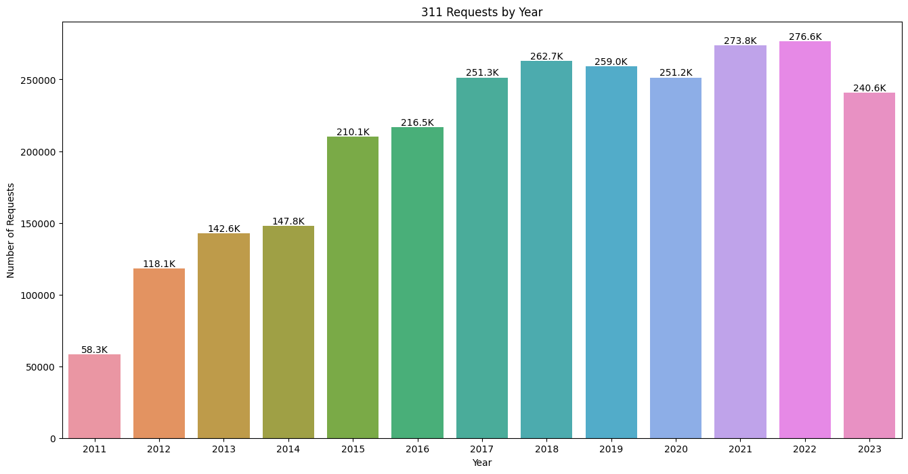

## Which service requests are most common for the city overall AND by  NEIGHBORHOOD and how is this changing year over year by SUBJECT (department), REASON,QUEUE?

### Overall

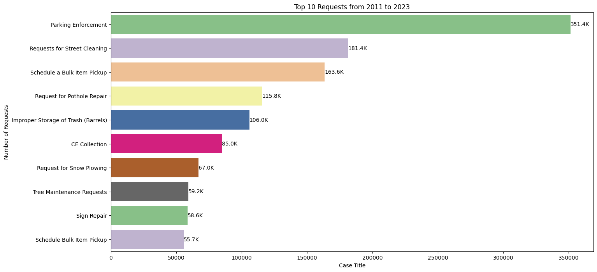

### By Neighborhood

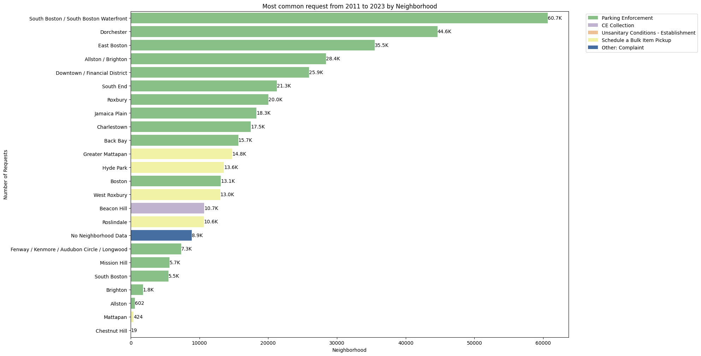

### By SUBJECT

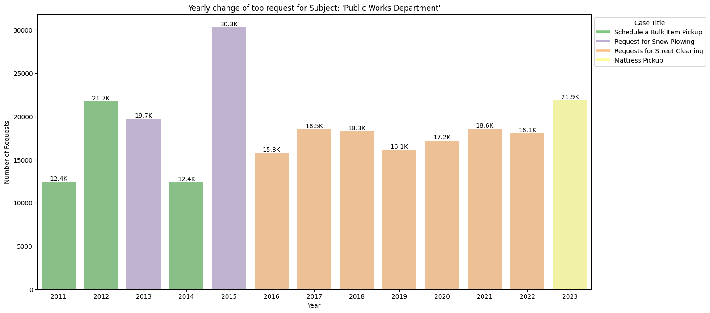

### By REASON

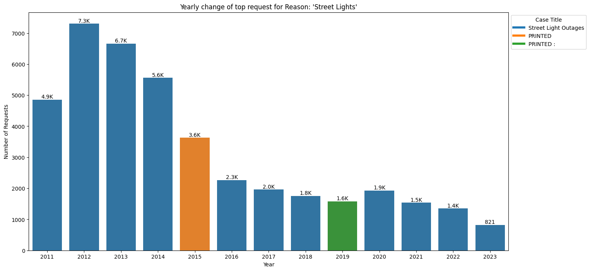

### By QUEUE

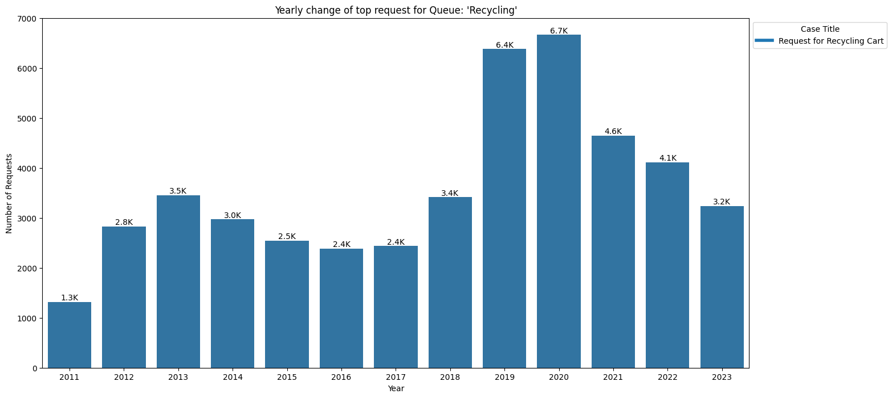

## How is the case volume changing by submission channel SOURCE?

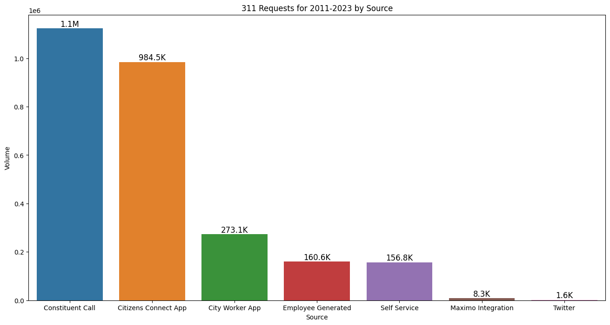

## What is the average # of daily contacts by year?

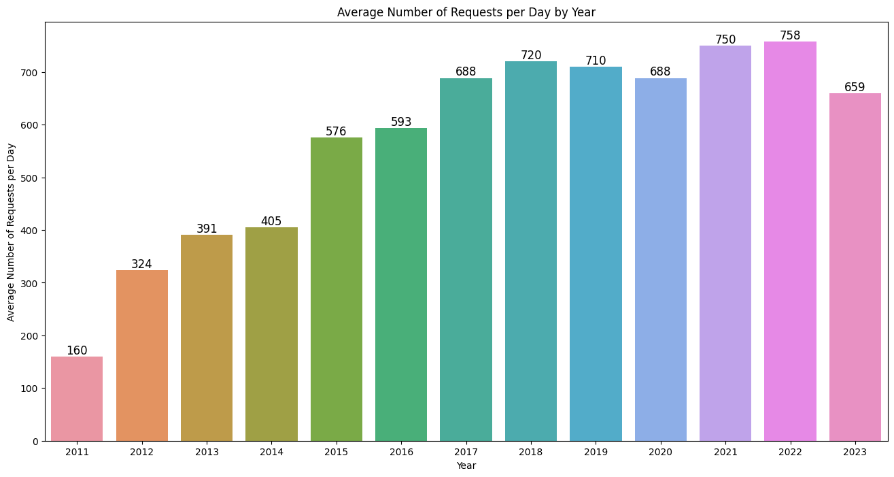

## Volume of top 5 request types (TYPE) 

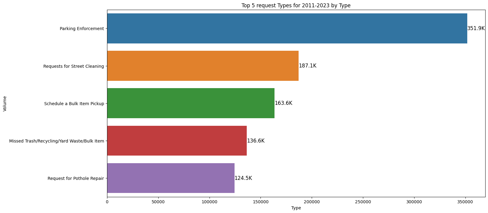

## Average goal resolution time by QUEUE

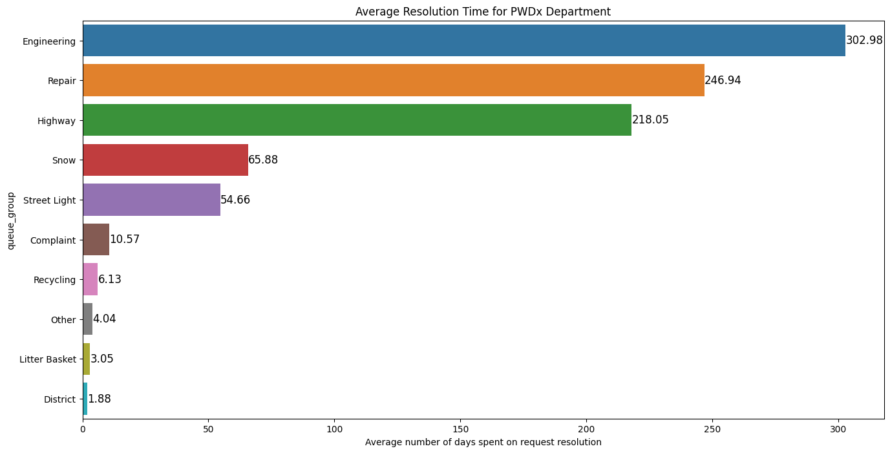

## Average goal resolution time by QUEUE and neighborhood

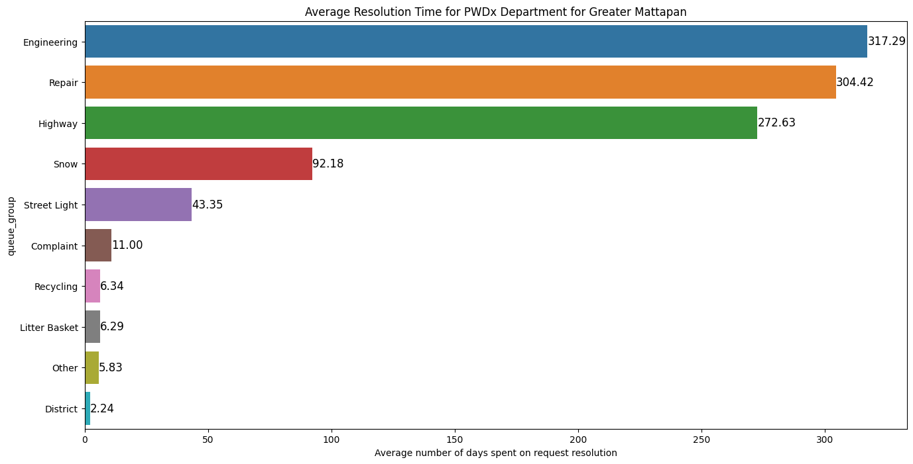

## What % of service requests are closed (CLOSED_DT or CASE_STATUS) vs. no data (CASE_STATUS = null) vs. unresolved (CASE_STATUS = open)?

### Overall
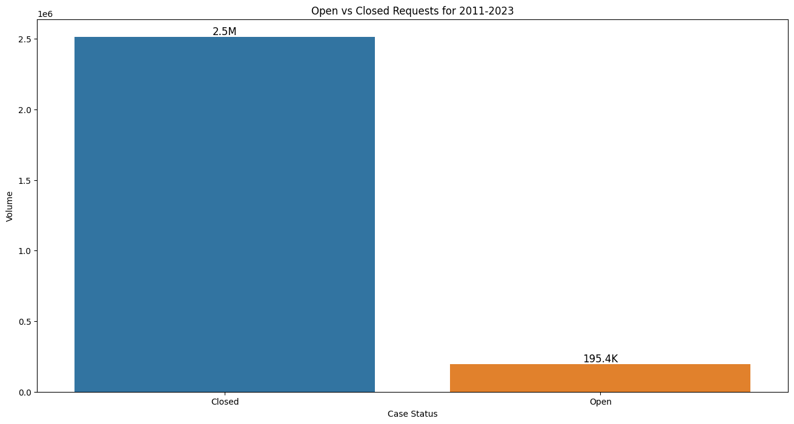
### By Year 
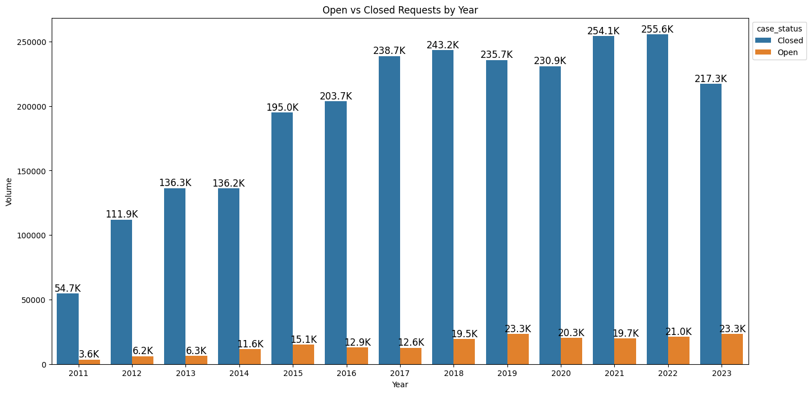
### By Year (proportion)
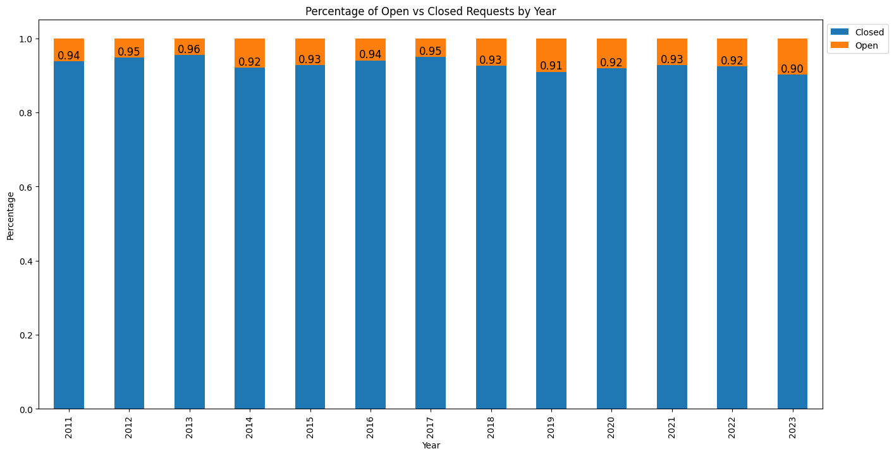

